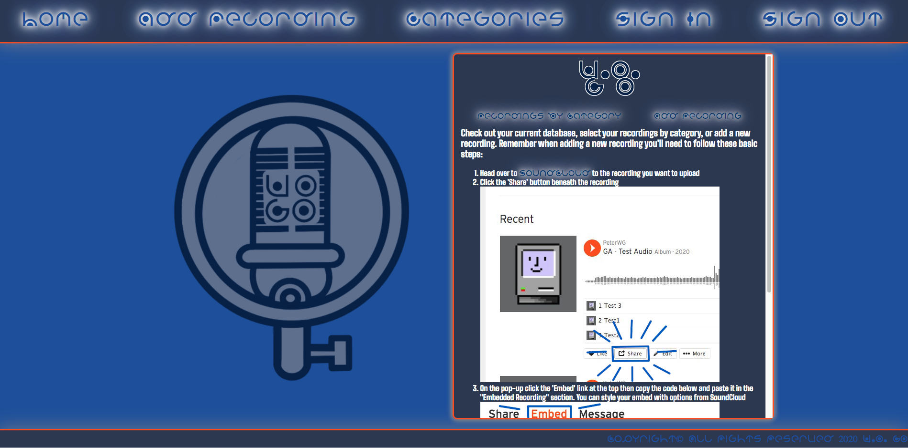
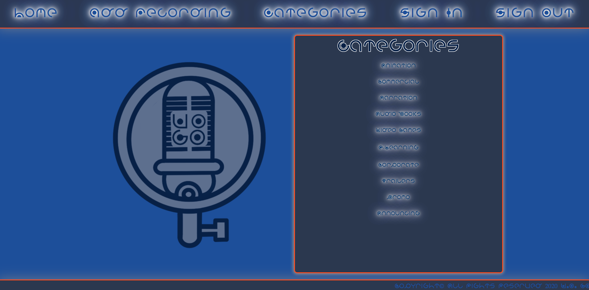
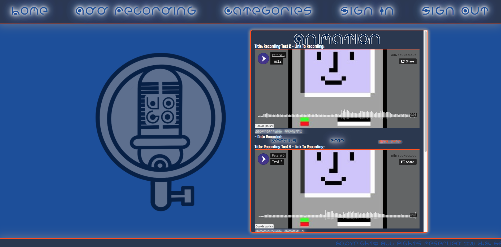
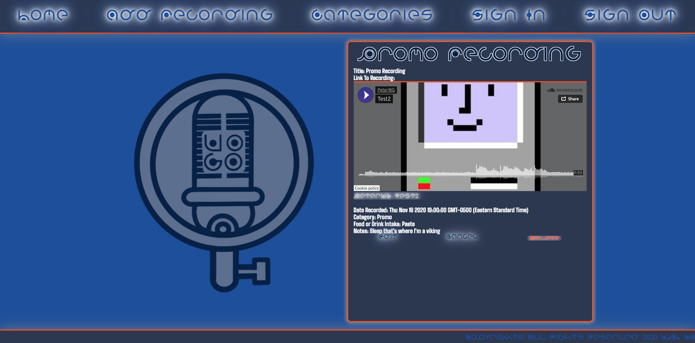

# V.O. GO

V.O. GO is an app that allows a user to enter upload an embedded Soundcloud link and some information to a database and perform CRUD on those recordings.

I was inspired to make this app after reading an online conversation between two Voice Over artists on a Facebook group who didn't like their current recording app. I posted questions about what functionality and data they'd want to track.

## Getting Started
 [Click Here](https://vo-go.herokuapp.com/) to see the deployed app. Navigate per the links on the page and when adding a new recording you'll need an embeded Soundcloud link.

## Screenshots
Home: 
Index: 
Add: 
Show: 
Details: 
##  Technologies/API used:

- Node
- Express
- MongoDB
- HTML5
- CSS3
- JavaScript
- jQuery
- Procreate - wireframe and logo
- Soundcloud Embeds

## Trello
[Click Here][https://trello.com/b/eXZ7UyB4/project-two] to view my Trello board.

## Wireframe: 

## User Stories:
- AAU - I should be able to navigate to the home page
- AAU - I should be able to add a new voice recording with a Soundcloud embed
- AAU - I should be able to view my current voice recordings
- AAU - I should be able to edit and delete my recording or notes

## Stretch Goals/Future Goals:
- Add some Bootstrapping
- Upload a sound file to FireDB
- Add user/uthentication

